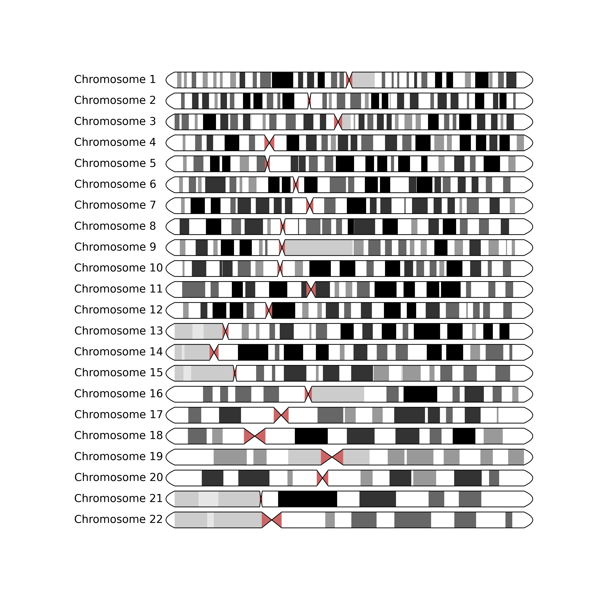

# pyryotype

[](https://pypi.org/project/pyryotype)
[](https://pypi.org/project/pyryotype)

-----

**Table of Contents**

- [pyryotype](#pyryotype)
  - [Installation](#installation)
  - [Example usage](#example-usage)
  - [License](#license)
  - [Cytoband data](#cytoband-data)

## Installation

```console
    pip install ideogram
```

## Example usage

```python
from pyryotype import GENOME, plot_ideogram
from matplotlib import pyplot as plt
fig, axes = plt.subplots(
    ncols=1,
    nrows=22,
    figsize=(11, 11),
    facecolor="white",
)
genome = GENOME.CHM13
for ax, contig_name in zip(axes, range(1, 23)):
    chromosome = f"chr{contig_name}"
    plot_ideogram(ax, target=chromosome, genome=genome)
fig.savefig("ideogram.png", dpi=300)
```

Will output:


## License

`pyryotype` is distributed under the terms of the [MIT](https://spdx.org/licenses/MIT.html) license.

## Cytoband data
* HG38 - Nushell, will have to be adapted for bash `curl -L "https://hgdownload.cse.ucsc.edu/goldenpath/hg38/database/cytoBand.txt.gz" | gzip -d - | rg -Ne "^chr\\d+\t" | save cytoBand_HG38.tsv`
* CHM13 - bash yay `curl -L http://t2t.gi.ucsc.edu/chm13/hub/t2t-chm13-v2.0/download/chm13v2.0_cytobands_allchrs.bed.gz | gzip -d - > cytobands_chm13.bed`
